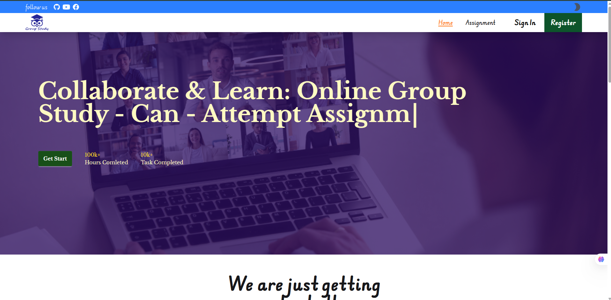

<table>
    <tr>
        <td width="65%">
            <h1>Hi 👋, I'm Muksitul Islam</h1>
     

Assionate Software Developer with a BSc in CSE, specializing in high-performance web applications using React, React Router, Axios, Next.js, and Tailwind CSS. Experienced in Firebase Authentication and expanding into full-stack development with Node.js, Express, JWT and MongoDB.

    Open to collaboration on innovative projects. Let’s connect and build something impactful! 🚀 #WebDevelopment #React #NextJS #TailwindCSS #RecentGraduate

        </td>
        <td hieght="50%">  
 
 

    <a href="https://muksitul-islam.web.app" >
    Portfolio
    </a>

<a href='muksitul.islam.mi@gmail.com ' target='_blank'>muksitul.islam.mi@gmail.com</a>

Kishoreganj, Dhaka, Bangladesh

<h3>🚀 My skill set includes:</h3>

</td>
</tr>

</table>

  

## Current Activity

- I am exploring NEXT.JS or I’m working on a tourism website,etc.

## 🏆 GitHub Trophies

## **Latest Projects** 🚀

These are my advanced and polished projects, showcasing full functionality and design.

<table>  
  <thead>  
    <tr>  
      <th>Project Name</th>  
      <th>OverView</th>  
      <th>Tools</th>  
      <th>Live Demo</th>  
      <th>Code</th>  
      <th>Screenshot</th>  
    </tr>  
  </thead>  
  <tbody> 
    <tr>  
      <td><strong>Online group Study</strong></td>  
      <td><strong>A online group Study Platform can Create assignment , can participate on assignment , can marked on assignment</strong></td>  
      <td>  
       React router, Axios, TailwindCSS, Node js, mongoDB, JWT, Versel
      </td>  
      <td></td>  
      <td></td>  
      <td></td>  
    </tr> 
   
  </tbody>  
</table>

# 💻 Tech Stack:

                                

  

### 🌐 Connect with Me:

    

## 🌐 Stay Updated with me:

<!--  -->

# 📊 GitHub Stats:

<table >
    <tr>
        <td style="text-align: center;">
            
        </td>
        <td style="text-align: center;">
            
        </td>
    </tr>
</table>

