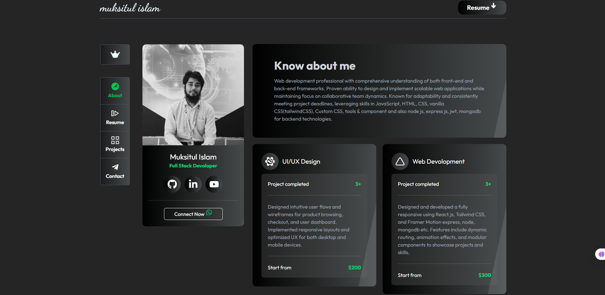

<table>
    <tr>
        <td width="65%">
            <h1>Hi 👋, I'm Imran Parthib</h1>
     

assionate Software Developer with a BSc in CSE, specializing in high-performance web applications using React, React Router, Axios, Next.js, and Tailwind CSS. Experienced in Firebase Authentication and expanding into full-stack development with Node.js, Express, JWT and MongoDB.

    Open to collaboration on innovative projects. Let’s connect and build something impactful! 🚀 #WebDevelopment #React #NextJS #TailwindCSS #RecentGraduate

        </td>
        <td hieght="50%">  
 
 

    <a href="https://imranparthib.me/" >
    Portfolio
    </a>

<h3>🚀 My skill set includes:</h3>

</td>
</tr>

</table>

  

## 🏆 GitHub Trophies

## **Latest Projects** 🚀

These are my advanced and polished projects, showcasing full functionality and design.

<table>  
  <thead>  
    <tr>  
      <th>Project Name</th>  
      <th>Tools</th>  
      <th>Live Demo</th>  
      <th>Code</th>  
      <th>Screenshot</th>  
    </tr>  
  </thead>  
  <tbody> 
    <tr>  
      <td><strong>Online Kenakata</strong></td>  
      <td>  
          
          
          
          
          
          
      </td>  
      <td></td>  
      <td></td>  
      <td></td>  
    </tr> 
    <tr>  
      <td><strong>PiLab</strong></td>  
      <td>  
          
          
          
          
      </td>  
      <td></td>  
      <td></td>  
      <td></td>  
    </tr>   
    <tr>  
      <td><strong>Islamic Mission Japan</strong></td>  
      <td>  
          
          
          
          
          
          
      </td>  
      <td></td>  
      <td></td>  
      <td></td>  
    </tr>
    <tr>
      <td><strong>StackBridge</strong></td>  
      <td>  
          
          
          
          
          
      </td>  
      <td></td>  
      <td></td>  
      <td></td>  
    </tr>  
    <tr>  
      <td><strong>Exam-Timer</strong></td>  
      <td>  
          
          
          
          
      </td>  
      <td></td>  
      <td></td>  
      <td></td>  
    </tr>
    <tr>  
      <td><strong>ReactCafe</strong></td>  
      <td>  
          
          
          
          
      </td>  
      <td></td>  
      <td></td>  
      <td></td>  
    </tr>
  </tbody>  
</table>

  

### 🌐 Connect with Me:

    

- 🔭 I’m currently working on [E-Commerce-App](https://extramile.vercel.app/)

- 🌱 I’m currently learning **Next.js,Node.js,Express.js,MongoDB**

- 👯 I’m looking to collaborate on [Pilab](https://github.com/ImranParthib/pilab)

- 👨‍💻 All of my projects are available at [https://imranparthib.me](https://imranparthib.me)

- 📝 I regularly write articles on [https://dev.to/imranparthib](https://dev.to/imranparthib)

- ⚡ Fun fact: Once lost in the prose of novels, now found in the elegance of code. My story evolved—chapters rewritten in the world of software development, chasing dreams to turn them into reality. 📖💻✨ #NovelsToCode 📖💻✨ #NovelsToCode"\*\*

### 🎥 [Latest YouTube Videos](https://youtube.com/@decode_us?sub_confirmation=1)

<!-- YOUTUBE-VIDEOS-LIST:START --><table><tr><td></td>
<td><a href="https://www.youtube.com/shorts/SgLfADL7EJs">Next.js 14 Is a Game Changer for React Developers! #Next.js  #reels  #developer  #2025</a> Jun 14, 2025</td></tr></table>
<table><tr><td></td>
<td><a href="https://www.youtube.com/watch?v=VzzE-2PmtlI">Top 10 AI Editor For Web Developers #coding #ai #programming #webdevelopment #trending #trend  #2025</a> May 8, 2025</td></tr></table>
<table><tr><td></td>
<td><a href="https://www.youtube.com/watch?v=A7FOtwAkfJU">Review of portfolio websites along with some development tips for using Git and GitHub.</a> May 7, 2025</td></tr></table>
<table><tr><td></td>
<td><a href="https://www.youtube.com/watch?v=Qb9EgK-g1Rc">Top 5 Programming Languages to Learn in 2025 &lpar;In Just 5 Minutes!&rpar; #programming #top #viralvideo</a> Mar 24, 2025</td></tr></table>
<table><tr><td></td>
<td><a href="https://www.youtube.com/watch?v=9EmybwEprmQ">I sold my first SaaS for $50,000</a> Mar 24, 2025</td></tr></table>
<!-- YOUTUBE-VIDEOS-LIST:END -->

### 📝 [Latest Blog Posts](https://dev.to/imranparthib)

<!-- BLOG-POST-LIST:START -->

- [# JavaScript ES6 Features](https://dev.to/imranparthib/-javascript-es6-features-35di)
- [Understanding Arrow Functions in JavaScript: Advantages and Best Practices](https://dev.to/imranparthib/understanding-arrow-functions-in-javascript-advantages-and-best-practices-1am7)
- [Embracing 2024: A Guide to Personal, Community, and Technological Contributions Introduction](https://dev.to/imranparthib/embracing-2024-a-guide-to-personal-community-and-technological-contributions-introduction-14m5)
- [Navigating the Sea of Software Development: A Conscious Approach](https://dev.to/imranparthib/navigating-the-sea-of-software-development-a-conscious-approach-3gcc)
<!-- BLOG-POST-LIST:END -->

## 🌐 Stay Updated with me:

<!--  -->

            
  
<!--  -->

<!--  -->

# 💻 Tech Stack:

                                

# 🎗️ Support Me:

            <!--  -->
            
  

# 📊 GitHub Stats:

<table >
    <tr>
        <td style="text-align: center;">
            
        </td>
        <td style="text-align: center;">
            
        </td>
    </tr>
    <tr>
        <td  style="text-align: center;">
            
        </td>
        <td  style="text-align: center;">
                
        </td> 
    </tr>
</table>
<be>
<!--  -->
    ✍️Random Dev Quote & Meme:
    <table>
        <tr>
            <td>
                
            </td>
            <td>
                
            </td>
        </tr>
    </table>
